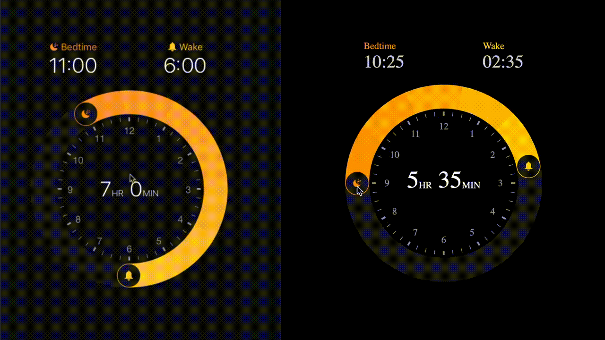

[]()
[](https://www.npmjs.com/package/react-web-circular-slider)

# react-web-circular-slider

ReactJS component for creating circular slider.
This is a rework of the [original React-Native project](https://github.com/bartgryszko/react-native-circular-slider) to support ReactJS.

## Example app – inspired by Apple's Bedtime :alarm_clock:

(It's just an example what you can achieve – with this package you can create any circular slider)

### Original React Native Demo


### Side By sude with Web Control

(Appologies - the video does not do the original justice - the recording slowed it down due to the gif)



## Installation

1. Install library

    ```
    npm i --save react-web-circular-slider
    ```

## Usage

Import Circular Slider

```js
import { CircularSlider } from 'react-web-circular-slider';
```

Use as follows:

```jsx
<CircularSlider
  startAngle={startAngle}
  angleLength={angleLength}
  onUpdate={({ startAngle, angleLength }) => this.setState({ startAngle, angleLength })}
  segments={5}
  strokeWidth={40}
  radius={145}
  gradientColorFrom="#ff9800"
  gradientColorTo="#ffcf00"
  showClockFace=True,
  clockFaceColor="#9d9d9d"
  bgCircleColor="#171717"
  stopIcon={<G><Path .../></G>}
  startIcon={<G><Path .../></G>}
/>
```

## Configuration

You can configure the slider by passing of the following props:

-   **startAngle** – angle where the slider starts (from 0 to 2π)
-   **angleLength** - length of the slider (from 0 to 2π)
    where data is an object of new values of startAngle and angleLength.
-   **segments (optional)** - SVG doesn't support canonical gradients, so it's imitated by using multiple linear gradients across the slider. In most cases 5 should be fine.
-   **strokeWidth (optional)** - width of slider
-   **radius (optional)** - size of the slider
-   **gradientColorFrom (optional)** - initial gradient color
-   **gradientColorTo (optional)** - final gradient color
-   **showClockFace (optional)** - if component should render clock face
-   **bgCircleColor (optional)** - color of the circle under the slider (pathway for a slider)
-   **stopIcon (optional)** - SVG Path for a stop icon (see the example)
-   **startIcon (optional)** - SVG Path for a start icon (see the example)

## Change events

-   **onUpdate({ startAngle, angleLength, startTime, endTime, durationMinutes })** - when either start or end slider is moved. onUpdate(data) is triggered, where data is an object of new values of startAngle, angleLength, startTime({h, m}), endTime({h, m}) and duration [int] value expressed in total minutes.
-   **onStartUpdate({ startAngle, startTime, durationMinutes })** - when the start slider is moved. onStartUpdate(data) is triggered, where data is an object of new values of startAngle, startTime({h, m}) and duration [int] value expressed in total minutes.
-   **onEndUpdate({ angleLength, endTime, durationMinutes })** - when the end slider is moved. onEndUpdate(data) is triggered, where data is an object of new values of angleLength, endTime({h, m}) and duration [int] value expressed in total minutes.

## Working example app

There is an example in the `example` directory. To get it running, simply run:

    ```
    npm install
    npm start
    ```

and you shold be able to access the example on the default
`localhost:3000`

## Author

Updated by Quentin Barnard.
Original code by Bartosz Gryszko (b@gryszko.com)

## License

MIT
